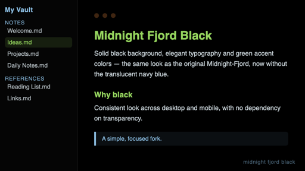

# Midnight Fjord Black



A fork of the [Midnight-Fjord](https://github.com/Quinta0/Midnight-Fjord) theme,
by [Quintavalle Pietro](https://quinta0.github.io/), with a single change: the
background (main area and both sidebars) goes from a translucent navy blue to
solid black, for visual consistency between desktop and mobile.

Everything else — typography, accent colors, layout — is identical to the
original. Full credit for the design goes to the original author; this fork
is under the same MIT license (see [LICENSE](LICENSE)).

## Installation

### From within Obsidian (Community Themes)

1. Open **Settings → Appearance → Themes → Browse**.
2. Search for "Midnight Fjord Black".
3. Select **Install and use**.

### Manual installation

1. Download `manifest.json` and `theme.css` from this repository (or from the
   [latest release](../../releases/latest)).
2. Copy both files to `<your-vault>/.obsidian/themes/Midnight Fjord Black/`.
3. In Obsidian: **Settings → Appearance → Theme** and select "Midnight Fjord Black".

## What changed

In `.theme-dark`, the background variables went from:

```css
--background-primary: rgba(11, 26, 39, 0.87);
```

to:

```css
--background-primary: #000000;
--background-secondary: #000000;
--background-secondary-alt: #000000;
```

---

## Português (BR)

Um fork do tema [Midnight-Fjord](https://github.com/Quinta0/Midnight-Fjord), de
[Quintavalle Pietro](https://quinta0.github.io/), com uma única mudança: o fundo
(área principal e as duas sidebars) passa de azul-marinho translúcido para preto
sólido, para ficar consistente entre desktop e mobile.

Todo o resto do tema — tipografia, cores de destaque, layout — é idêntico ao
original. Crédito integral do design ao autor original; este fork está sob a
mesma licença MIT (ver [LICENSE](LICENSE)).

### O que mudou

Em `.theme-dark`, as variáveis de fundo passaram de:

```css
--background-primary: rgba(11, 26, 39, 0.87);
```

para:

```css
--background-primary: #000000;
--background-secondary: #000000;
--background-secondary-alt: #000000;
```

### Instalação manual

1. Baixe `manifest.json` e `theme.css` deste repositório.
2. Copie os dois arquivos para `<seu-vault>/.obsidian/themes/Midnight Fjord Black/`.
3. No Obsidian: **Ajustes → Aparência → Tema** e selecione "Midnight Fjord Black".

### Instalação via Community Themes

**Ajustes → Aparência → Temas → Procurar** e busque por "Midnight Fjord Black".
